# Solana RBAC — Architecture & Instruction Flows

> All diagrams use [Mermaid](https://mermaid.js.org/) syntax.
> Render in VS Code with the **Markdown Preview Mermaid Support** extension,
> or view on GitHub which renders Mermaid natively.

---

## Table of Contents

1. [High-Level System Architecture](#1-high-level-system-architecture)
2. [Account Data Model](#2-account-data-model)
   - 2.5 [Entity Map — Containment & Reference Relationships](#25-entity-map--containment--reference-relationships)
3. [PDA Derivation Map](#3-pda-derivation-map)
4. [State Machine](#4-state-machine)
5. [Instruction Flows](#5-instruction-flows)
   - 5.1 [initialize_organization](#51-initialize_organization)
   - 5.2 [create_role](#52-create_role-updating-state-required)
   - 5.3 [assign_role](#53-assign_role-idle-state--inline-recompute)
   - 5.4 [revoke_role](#54-revoke_role-idle-state--full-per-user-recompute)
   - 5.5 [recompute_role](#55-role-hierarchy--recompute_role-updating-state)
   - 5.6 [process_recompute_batch](#56-process_recompute_batch-recomputing-state)
   - 5.7 [has_permission](#57-has_permission-idle--free-off-chain-on-chain-via-cpi)
   - 5.8 [has_role](#58-has_role)
   - 5.9 [create_resource / delete_resource](#59-create_resource--delete_resource)
6. [Permission Check — All Methods](#6-permission-check--all-methods)
7. [Authorization Flow — Who Can Do What](#7-authorization-flow--who-can-do-what)
8. [Multi-Tenant Architecture](#8-multi-tenant-architecture)
9. [CPI Integration — Other Programs Using RBAC](#9-cpi-integration--other-programs-using-rbac)
10. [Web2 Integration Architecture](#10-web2-integration-architecture)
11. [Trust & Governance Lifecycle](#11-trust--governance-lifecycle)
12. [Complete Transaction Cost Map](#12-complete-transaction-cost-map)
13. [Permission Bitmask Encoding](#13-permission-bitmask-encoding)
14. [Role Tree — Implemented (Children-First DAG)](#14-role-tree--implemented-children-first-dag)
15. [RoleRef — Per-Role Staleness Tracking](#15-roleref--per-role-staleness-tracking)

---

## 1. High-Level System Architecture

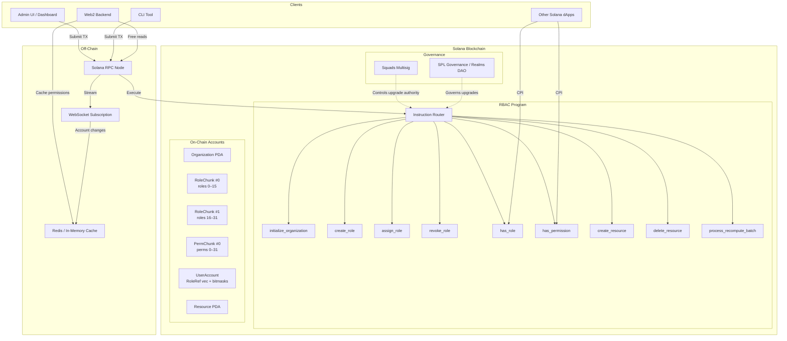
```mermaid
graph TB
    subgraph Clients
        AdminUI[Admin UI / Dashboard]
        CLI[CLI Tool]
        Web2[Web2 Backend]
        DApp[Other Solana dApps]
    end

    subgraph Solana Blockchain
        subgraph RBAC Program
            IX[Instruction Router]
            IX --> InitOrg[initialize_organization]
            IX --> CR[create_role]
            IX --> AR[assign_role]
            IX --> RR[revoke_role]
            IX --> HR[has_role]
            IX --> HP[has_permission]
            IX --> CRes[create_resource]
            IX --> DRes[delete_resource]
            IX --> PRB[process_recompute_batch]
        end

        subgraph On-Chain Accounts
            OrgA[Organization PDA]
            RC0[RoleChunk #0<br/>roles 0–15]
            RC1[RoleChunk #1<br/>roles 16–31]
            PC0[PermChunk #0<br/>perms 0–31]
            UA[UserAccount<br/>RoleRef vec + bitmasks]
            Res1[Resource PDA]
        end

        subgraph Governance
            Squads[Squads Multisig]
            Realms[SPL Governance / Realms DAO]
        end
    end

    subgraph Off-Chain
        RPC[Solana RPC Node]
        Cache[Redis / In-Memory Cache]
        WS[WebSocket Subscription]
    end

    AdminUI -->|Submit TX| RPC
    CLI -->|Submit TX| RPC
    Web2 -->|Free reads| RPC
    Web2 -->|Cache permissions| Cache
    RPC -->|Execute| IX
    DApp -->|CPI| HR
    DApp -->|CPI| HP
    WS -->|Account changes| Cache
    RPC -->|Stream| WS
    Squads -.->|Controls upgrade authority| IX
    Realms -.->|Governs upgrades| IX
```

---

## 2. Account Data Model

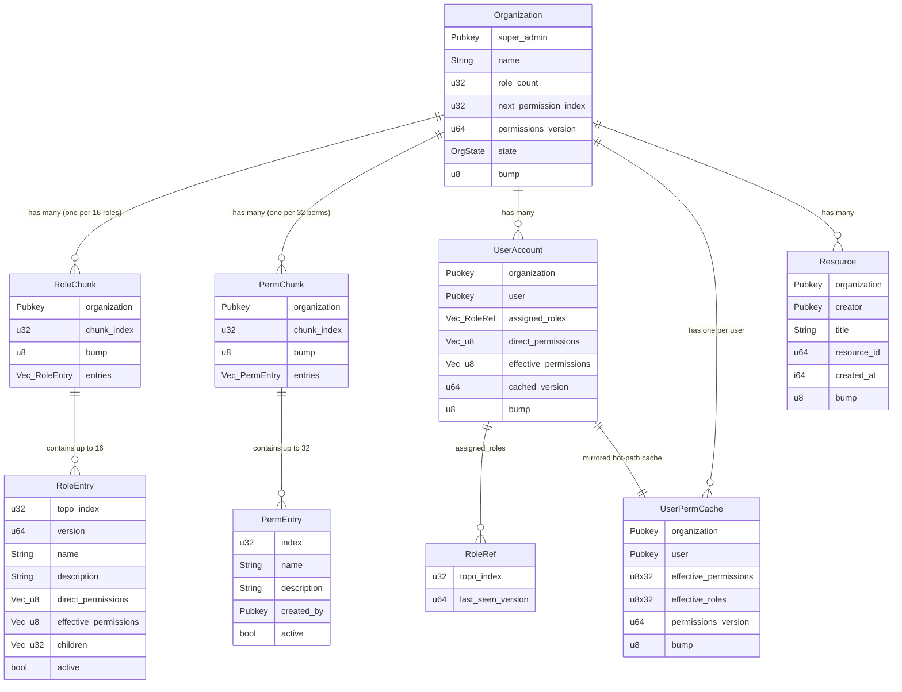
```mermaid
erDiagram
    Organization ||--o{ RoleChunk : "has many (one per 16 roles)"
    Organization ||--o{ PermChunk : "has many (one per 32 perms)"
    Organization ||--o{ UserAccount : "has many"
    Organization ||--o{ UserPermCache : "has one per user"
    Organization ||--o{ Resource : "has many"
    RoleChunk ||--o{ RoleEntry : "contains up to 16"
    PermChunk ||--o{ PermEntry : "contains up to 32"
    UserAccount ||--o{ RoleRef : "assigned_roles"
    UserAccount ||--|| UserPermCache : "mirrored hot-path cache"

    Organization {
        Pubkey super_admin
        String name
        u32 role_count
        u32 next_permission_index
        u64 permissions_version
        OrgState state
        u8 bump
    }

    RoleChunk {
        Pubkey organization
        u32 chunk_index
        u8 bump
        Vec_RoleEntry entries
    }

    RoleEntry {
        u32 topo_index
        u64 version
        String name
        String description
        Vec_u8 direct_permissions
        Vec_u8 effective_permissions
        Vec_u32 children
        bool active
    }

    PermChunk {
        Pubkey organization
        u32 chunk_index
        u8 bump
        Vec_PermEntry entries
    }

    PermEntry {
        u32 index
        String name
        String description
        Pubkey created_by
        bool active
    }

    UserAccount {
        Pubkey organization
        Pubkey user
        Vec_RoleRef assigned_roles
        Vec_u8 direct_permissions
        Vec_u8 effective_permissions
        u64 cached_version
        u8 bump
    }

    RoleRef {
        u32 topo_index
        u64 last_seen_version
    }

    UserPermCache {
        Pubkey organization
        Pubkey user
        u8x32 effective_permissions
        u8x32 effective_roles
        u64 permissions_version
        u8 bump
    }

    Resource {
        Pubkey organization
        Pubkey creator
        String title
        u64 resource_id
        i64 created_at
        u8 bump
    }
```

---

## 2.5 Entity Map — Containment & Reference Relationships

All accounts and embedded structs within a single organization, with three distinct
relationship types:

| Arrow | Meaning |
|-------|---------|
| `→` solid | **Pubkey field** — the source account stores the target's public key as a field |
| `⟹` thick | **Physical containment** — the struct lives inside the source account's data buffer (not a separate PDA) |
| `⇢` dashed | **Logical index reference** — resolved via arithmetic (`topo_index N → chunk[N÷16].entries[N%16]`), never stored as a Pubkey |

### 2.5.1 Structural Relationships

> All PDAs below belong to a single Organization instance. The outer boundary is logical — every PDA stores `organization: Pubkey` as a FK back to the same Organization PDA.

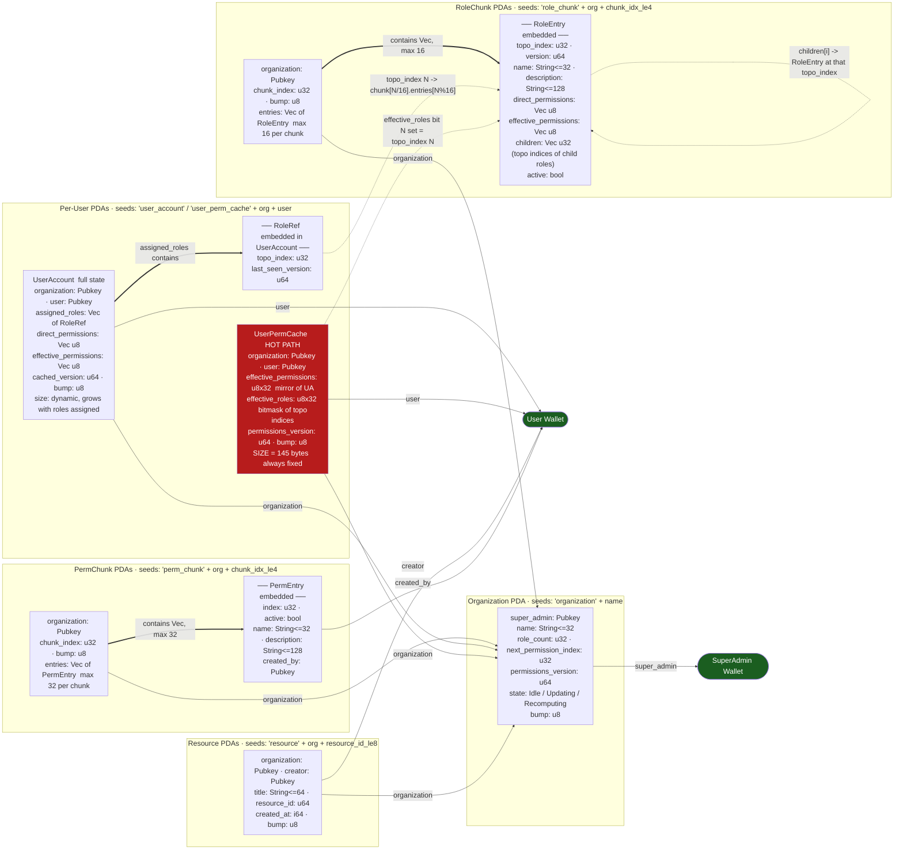
```mermaid
%%{init: {'themeVariables': {'fontSize': '24px'}, 'flowchart': {'nodeSpacing': 60, 'rankSpacing': 140}}}%%
graph LR
    SA([SuperAdmin Wallet])
    UW([User Wallet])

    subgraph OrgNode["Organization PDA · seeds: 'organization' + name"]
        Org["super_admin: Pubkey<br/>name: String&lt;=32<br/>role_count: u32 · next_permission_index: u32<br/>permissions_version: u64<br/>state: Idle / Updating / Recomputing<br/>bump: u8"]
    end

    subgraph RoleChunks["RoleChunk PDAs · seeds: 'role_chunk' + org + chunk_idx_le4"]
        RC["organization: Pubkey<br/>chunk_index: u32 · bump: u8<br/>entries: Vec of RoleEntry  max 16 per chunk"]
        RE["── RoleEntry  embedded ──<br/>topo_index: u32 · version: u64<br/>name: String&lt;=32 · description: String&lt;=128<br/>direct_permissions: Vec u8<br/>effective_permissions: Vec u8<br/>children: Vec u32  (topo indices of child roles)<br/>active: bool"]
    end

    subgraph PermChunks["PermChunk PDAs · seeds: 'perm_chunk' + org + chunk_idx_le4"]
        PC["organization: Pubkey<br/>chunk_index: u32 · bump: u8<br/>entries: Vec of PermEntry  max 32 per chunk"]
        PE["── PermEntry  embedded ──<br/>index: u32 · active: bool<br/>name: String&lt;=32 · description: String&lt;=128<br/>created_by: Pubkey"]
    end

    subgraph UserPair["Per-User PDAs · seeds: 'user_account' / 'user_perm_cache' + org + user"]
        UA["UserAccount  full state<br/>organization: Pubkey · user: Pubkey<br/>assigned_roles: Vec of RoleRef<br/>direct_permissions: Vec u8<br/>effective_permissions: Vec u8<br/>cached_version: u64 · bump: u8<br/>size: dynamic, grows with roles assigned"]
        UPC["UserPermCache  HOT PATH<br/>organization: Pubkey · user: Pubkey<br/>effective_permissions: u8x32  mirror of UA<br/>effective_roles: u8x32  bitmask of topo indices<br/>permissions_version: u64 · bump: u8<br/>SIZE = 145 bytes  always fixed"]
        RR["── RoleRef  embedded in UserAccount ──<br/>topo_index: u32<br/>last_seen_version: u64"]
    end

    subgraph Resources["Resource PDAs · seeds: 'resource' + org + resource_id_le8"]
        Res["organization: Pubkey · creator: Pubkey<br/>title: String&lt;=64 · resource_id: u64<br/>created_at: i64 · bump: u8"]
    end

    %% Pubkey FK references (stored as Pubkey inside the account data)
    Org -->|"super_admin"| SA
    RC -->|"organization"| Org
    PC -->|"organization"| Org
    UA -->|"organization"| Org
    UA -->|"user"| UW
    UPC -->|"organization"| Org
    UPC -->|"user"| UW
    Res -->|"organization"| Org
    Res -->|"creator"| UW
    PE -->|"created_by"| UW

    %% Physical containment (data lives inside the account's data buffer)
    RC ==>|"contains Vec, max 16"| RE
    PC ==>|"contains Vec, max 32"| PE
    UA ==>|"assigned_roles contains"| RR

    %% Logical topo_index references (NOT Pubkeys - resolved via arithmetic)
    RR -.->|"topo_index N -> chunk[N/16].entries[N%16]"| RE
    RE -.->|"children[i] -> RoleEntry at that topo_index"| RE
    UPC -.->|"effective_roles bit N set = topo_index N"| RE

    style UPC fill:#B71C1C,color:#fff
    style SA fill:#1B5E20,color:#fff
    style UW fill:#1B5E20,color:#fff
```

### 2.5.2 Version & Staleness Chain

Two independent version clocks track freshness at different granularities.

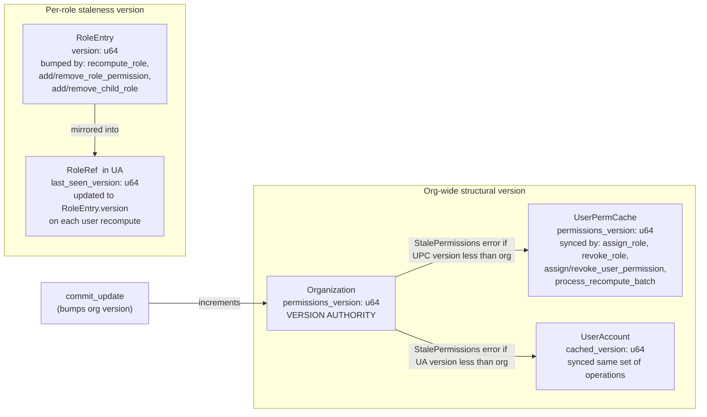
```mermaid
graph LR
    CU["commit_update\n(bumps org version)"]

    subgraph Structural["Org-wide structural version"]
        OV["Organization\npermissions_version: u64\nVERSION AUTHORITY"]
        UPV["UserPermCache\npermissions_version: u64\nsynced by: assign_role, revoke_role,\nassign/revoke_user_permission,\nprocess_recompute_batch"]
        UAV["UserAccount\ncached_version: u64\nsynced same set of operations"]
    end

    subgraph PerRole["Per-role staleness version"]
        REV["RoleEntry\nversion: u64\nbumped by: recompute_role,\nadd/remove_role_permission,\nadd/remove_child_role"]
        RRV["RoleRef  in UA\nlast_seen_version: u64\nupdated to RoleEntry.version\non each user recompute"]
    end

    CU -->|"increments"| OV
    OV -->|"StalePermissions error if UPC version less than org"| UPV
    OV -->|"StalePermissions error if UA version less than org"| UAV
    REV -->|"mirrored into"| RRV
```

### 2.5.3 Read/Write Access by Operation

| Operation | Accounts Read | Accounts Written | Notes |
|-----------|--------------|-----------------|-------|
| `has_permission` | UserPermCache | — | O(1), 145-byte account only |
| `has_role` | UserPermCache | — | O(1) bitmask, no Vec scan |
| `create_resource` | UserPermCache, Organization | Resource (init) | Permission check via UPC |
| `delete_resource` | UserPermCache, Organization | Resource (close) | Permission check via UPC |
| `assign_role` | RoleChunk, Organization | UserAccount, UserPermCache | Inline bitmask union |
| `revoke_role` | RoleChunks (remaining_accounts), Org | UserAccount, UserPermCache | Full inline recompute |
| `assign_user_permission` | Organization | UserAccount, UserPermCache | `set_bit` on both |
| `revoke_user_permission` | RoleChunks (remaining_accounts), Org | UserAccount, UserPermCache | Full inline recompute |
| `process_recompute_batch` | Organization, PermChunks, RoleChunks | UserAccount, UserPermCache | Batch via remaining_accounts |
| `create_role` | Organization | RoleChunk (`init_if_needed` + realloc) | Updating state |
| `create_permission` | Organization | PermChunk (`init_if_needed` + realloc) | Updating state |
| `recompute_role` | Org, PermChunks, child RoleChunks (remaining) | RoleChunk parent entry | Filters inactive perms; updates `effective_permissions` |
| `add_child_role` | Organization | RoleChunk parent `entry.children` | Updating state |
| `add_role_permission` | Organization | RoleChunk `entry.direct_permissions` | Updating state |
| delegation check | Caller's UserPermCache (remaining_accounts[0]) | — | Verifies `MANAGE_ROLES_PERMISSION_INDEX` bit 3 |

---

## 3. PDA Derivation Map

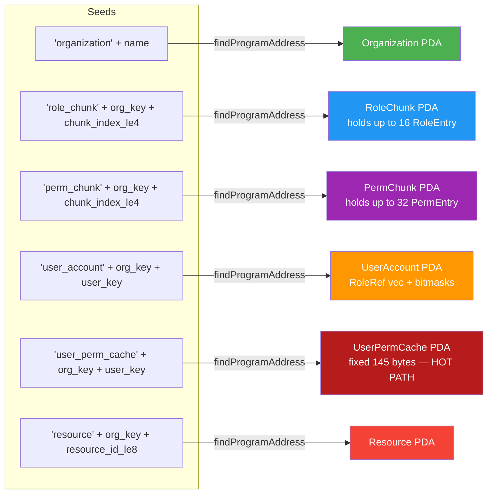
```mermaid
graph LR
    subgraph Seeds
        S1["'organization' + name"]
        S2["'role_chunk' + org_key + chunk_index_le4"]
        S3["'perm_chunk' + org_key + chunk_index_le4"]
        S4["'user_account' + org_key + user_key"]
        S5["'user_perm_cache' + org_key + user_key"]
        S6["'resource' + org_key + resource_id_le8"]
    end

    S1 -->|findProgramAddress| OrgPDA[Organization PDA]
    S2 -->|findProgramAddress| RcPDA[RoleChunk PDA<br/>holds up to 16 RoleEntry]
    S3 -->|findProgramAddress| PcPDA[PermChunk PDA<br/>holds up to 32 PermEntry]
    S4 -->|findProgramAddress| UAPDA[UserAccount PDA<br/>RoleRef vec + bitmasks]
    S5 -->|findProgramAddress| UpcPDA[UserPermCache PDA<br/>fixed 145 bytes — HOT PATH]
    S6 -->|findProgramAddress| ResPDA[Resource PDA]

    style OrgPDA fill:#4CAF50,color:#fff
    style RcPDA fill:#2196F3,color:#fff
    style PcPDA fill:#9C27B0,color:#fff
    style UAPDA fill:#FF9800,color:#fff
    style UpcPDA fill:#B71C1C,color:#fff
    style ResPDA fill:#f44336,color:#fff
```

### Chunk Index Arithmetic

| Item | Chunk index | Slot within chunk |
|------|-------------|-------------------|
| Role N (ROLES_PER_CHUNK = 16) | `N / 16` | `N % 16` |
| Permission N (PERMS_PER_CHUNK = 32) | `N / 32` | `N % 32` |

---

## 4. State Machine

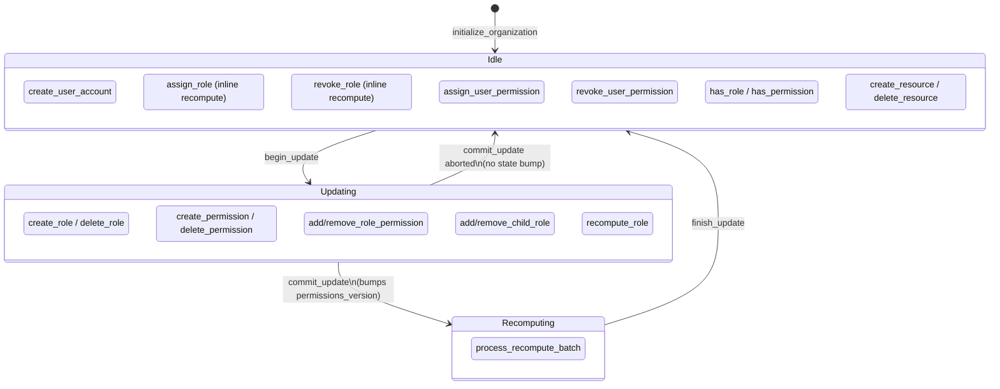
```mermaid
stateDiagram-v2
    [*] --> Idle : initialize_organization

    Idle --> Updating : begin_update
    Updating --> Idle : commit_update aborted\n(no state bump)
    Updating --> Recomputing : commit_update\n(bumps permissions_version)
    Recomputing --> Idle : finish_update

    state Idle {
        direction TB
        i1: create_user_account
        i2: assign_role (inline recompute)
        i3: revoke_role (inline recompute)
        i4: assign_user_permission
        i5: revoke_user_permission
        i6: has_role / has_permission
        i7: create_resource / delete_resource
    }

    state Updating {
        direction TB
        u1: create_role / delete_role
        u2: create_permission / delete_permission
        u3: add/remove_role_permission
        u4: add/remove_child_role
        u5: recompute_role
    }

    state Recomputing {
        direction TB
        r1: process_recompute_batch
    }
```

---

## 5. Instruction Flows

### 5.1 initialize_organization

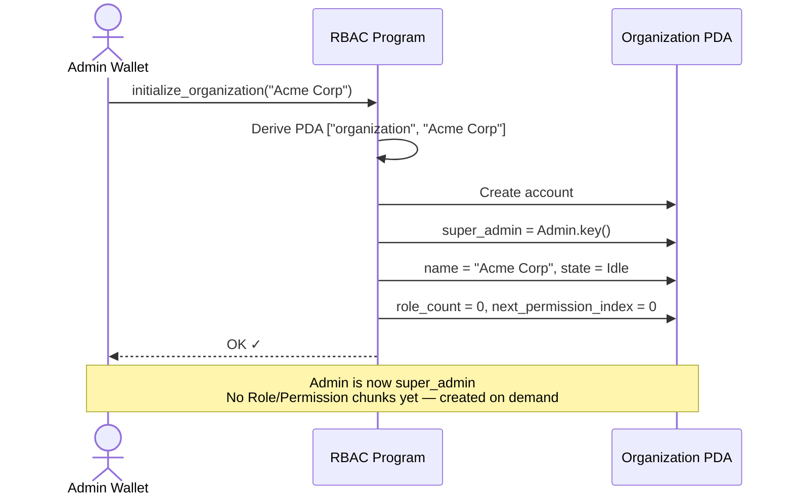
```mermaid
sequenceDiagram
    actor Admin as Admin Wallet
    participant P as RBAC Program
    participant Org as Organization PDA

    Admin->>P: initialize_organization("Acme Corp")
    P->>P: Derive PDA ["organization", "Acme Corp"]
    P->>Org: Create account
    P->>Org: super_admin = Admin.key()
    P->>Org: name = "Acme Corp", state = Idle
    P->>Org: role_count = 0, next_permission_index = 0
    P-->>Admin: OK ✓

    Note over Admin,Org: Admin is now super_admin<br/>No Role/Permission chunks yet — created on demand
```

### 5.2 create_role (Updating state required)

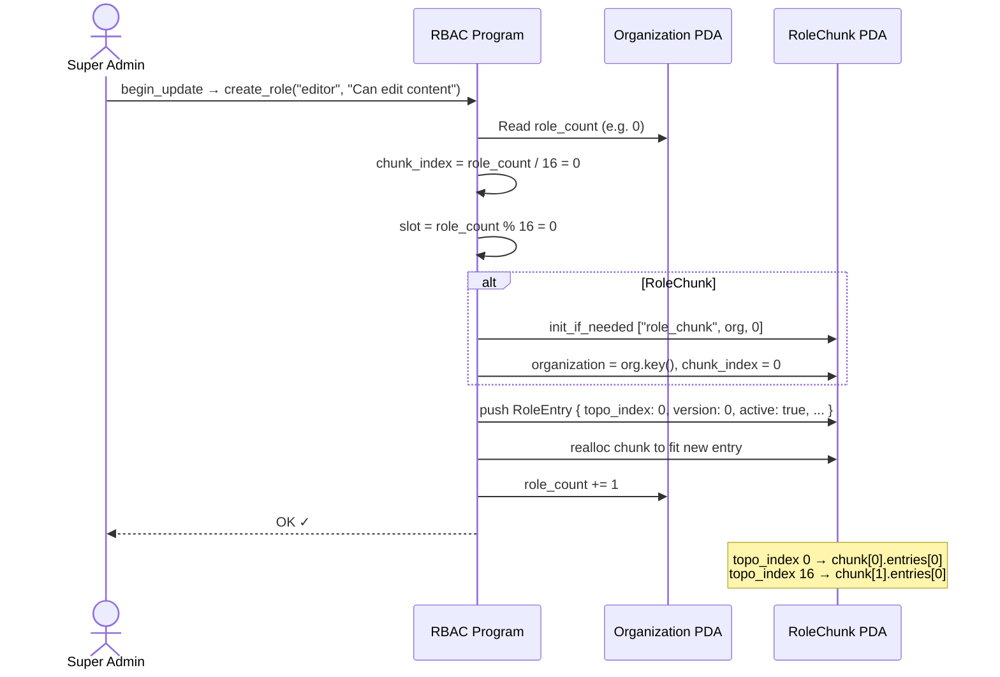
```mermaid
sequenceDiagram
    actor Admin as Super Admin
    participant P as RBAC Program
    participant Org as Organization PDA
    participant RC as RoleChunk PDA

    Admin->>P: begin_update → create_role("editor", "Can edit content")
    P->>Org: Read role_count (e.g. 0)
    P->>P: chunk_index = role_count / 16 = 0
    P->>P: slot = role_count % 16 = 0

    alt RoleChunk #0 does not yet exist
        P->>RC: init_if_needed ["role_chunk", org, 0]
        P->>RC: organization = org.key(), chunk_index = 0
    end

    P->>RC: push RoleEntry { topo_index: 0, version: 0, active: true, ... }
    P->>RC: realloc chunk to fit new entry
    P->>Org: role_count += 1
    P-->>Admin: OK ✓

    Note over RC: topo_index 0 → chunk[0].entries[0]<br/>topo_index 16 → chunk[1].entries[0]
```

### 5.3 assign_role (Idle state — inline recompute)

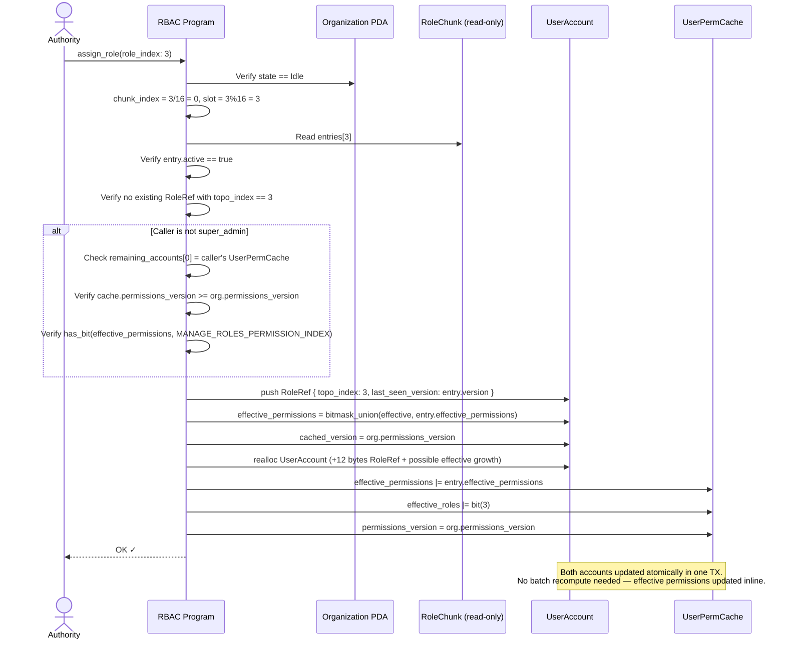
```mermaid
sequenceDiagram
    actor Caller as Authority
    participant P as RBAC Program
    participant Org as Organization PDA
    participant RC as RoleChunk (read-only)
    participant UA as UserAccount
    participant UPC as UserPermCache

    Caller->>P: assign_role(role_index: 3)
    P->>Org: Verify state == Idle
    P->>P: chunk_index = 3/16 = 0, slot = 3%16 = 3
    P->>RC: Read entries[3]
    P->>P: Verify entry.active == true
    P->>P: Verify no existing RoleRef with topo_index == 3

    alt Caller is not super_admin
        P->>P: Check remaining_accounts[0] = caller's UserPermCache
        P->>P: Verify cache.permissions_version >= org.permissions_version
        P->>P: Verify has_bit(effective_permissions, MANAGE_ROLES_PERMISSION_INDEX)
    end

    P->>UA: push RoleRef { topo_index: 3, last_seen_version: entry.version }
    P->>UA: effective_permissions = bitmask_union(effective, entry.effective_permissions)
    P->>UA: cached_version = org.permissions_version
    P->>UA: realloc UserAccount (+12 bytes RoleRef + possible effective growth)
    P->>UPC: effective_permissions |= entry.effective_permissions
    P->>UPC: effective_roles |= bit(3)
    P->>UPC: permissions_version = org.permissions_version
    P-->>Caller: OK ✓

    Note over UA,UPC: Both accounts updated atomically in one TX.<br/>No batch recompute needed — effective permissions updated inline.
```

### 5.4 revoke_role (Idle state — full per-user recompute)

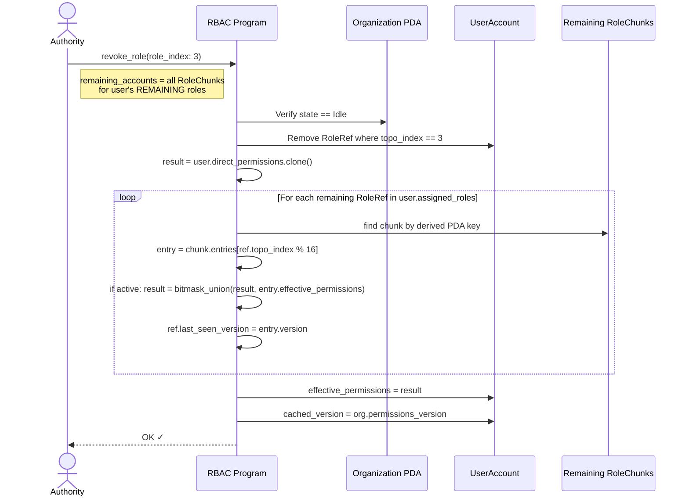
```mermaid
sequenceDiagram
    actor Caller as Authority
    participant P as RBAC Program
    participant Org as Organization PDA
    participant UA as UserAccount
    participant RCs as Remaining RoleChunks

    Caller->>P: revoke_role(role_index: 3)
    Note right of Caller: remaining_accounts = all RoleChunks<br/>for user's REMAINING roles

    P->>Org: Verify state == Idle
    P->>UA: Remove RoleRef where topo_index == 3
    P->>P: result = user.direct_permissions.clone()

    loop For each remaining RoleRef in user.assigned_roles
        P->>RCs: find chunk by derived PDA key
        P->>P: entry = chunk.entries[ref.topo_index % 16]
        P->>P: if active: result = bitmask_union(result, entry.effective_permissions)
        P->>P: ref.last_seen_version = entry.version
    end

    P->>UA: effective_permissions = result
    P->>UA: cached_version = org.permissions_version
    P-->>Caller: OK ✓
```

### 5.5 Role Hierarchy — recompute_role (Updating state)

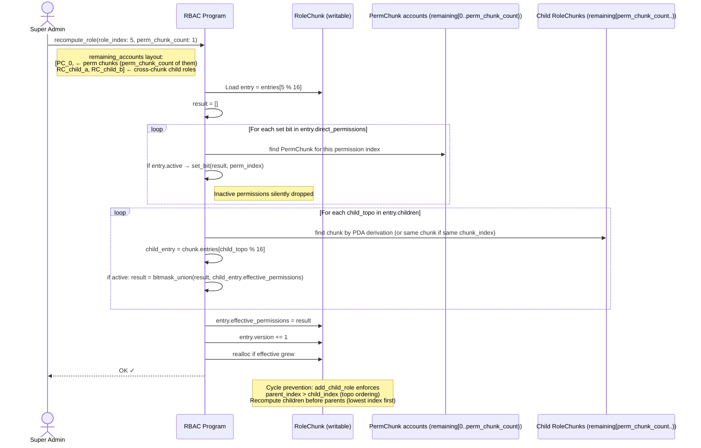
```mermaid
sequenceDiagram
    actor Admin as Super Admin
    participant P as RBAC Program
    participant RC as RoleChunk (writable)
    participant PCs as PermChunk accounts (remaining[0..perm_chunk_count))
    participant CRCs as Child RoleChunks (remaining[perm_chunk_count..))

    Admin->>P: recompute_role(role_index: 5, perm_chunk_count: 1)
    Note right of Admin: remaining_accounts layout:<br/>[PC_0,          ← perm chunks (perm_chunk_count of them)<br/> RC_child_a, RC_child_b]  ← cross-chunk child roles

    P->>RC: Load entry = entries[5 % 16]
    P->>P: result = []

    loop For each set bit in entry.direct_permissions
        P->>PCs: find PermChunk for this permission index
        P->>P: if entry.active → set_bit(result, perm_index)
        Note right of P: Inactive permissions silently dropped
    end

    loop For each child_topo in entry.children
        P->>CRCs: find chunk by PDA derivation (or same chunk if same chunk_index)
        P->>P: child_entry = chunk.entries[child_topo % 16]
        P->>P: if active: result = bitmask_union(result, child_entry.effective_permissions)
    end

    P->>RC: entry.effective_permissions = result
    P->>RC: entry.version += 1
    P->>RC: realloc if effective grew
    P-->>Admin: OK ✓

    Note over RC: Cycle prevention: add_child_role enforces<br/>parent_index > child_index (topo ordering)<br/>Recompute children before parents (lowest index first)
```

### 5.6 process_recompute_batch (Recomputing state)

```mermaid
sequenceDiagram
    actor Admin as Super Admin
    participant P as RBAC Program
    participant Org as Organization PDA
    participant PCs as PermChunk accounts (remaining[0..perm_chunk_count))
    participant RAs as remaining_accounts[perm_chunk_count..)

    Admin->>P: process_recompute_batch(user_chunk_counts: [2, 1], perm_chunk_count: 1)
    Note right of Admin: remaining_accounts layout:<br/>[PC_0,              ← perm_chunk_count PermChunks<br/> UA_1(mut), UPC_1(mut), RC_a, RC_b,<br/> UA_2(mut), UPC_2(mut), RC_a]

    P->>Org: Verify state == Recomputing

    loop For each user (chunk counts [2, 1])
        P->>RAs: Read UserAccount (writable)
        P->>RAs: Read UserPermCache (writable)
        P->>P: result = []

        loop For each set bit in user.direct_permissions
            P->>PCs: find PermChunk; if active → set_bit(result, perm_index)
        end

        loop For each RoleRef in user.assigned_roles
            P->>RAs: find matching RoleChunk by PDA
            loop For each set bit in entry.effective_permissions
                P->>PCs: if active → set_bit(result, perm_index)
            end
            P->>P: ref.last_seen_version = entry.version
        end

        P->>RAs: user.effective_permissions = result
        P->>RAs: user.cached_version = org.permissions_version
        P->>RAs: UPC.effective_permissions = result (fixed [u8;32])
        P->>RAs: UPC.effective_roles = bitmask of assigned topo_indices
        P->>RAs: UPC.permissions_version = org.permissions_version
    end

    P-->>Admin: OK ✓

    Note over PCs,RAs: Inactive permissions are filtered out in both<br/>direct_permissions and role effective_permissions.<br/>Deleted perms are silently dropped even if still set in bitmasks.
```

### 5.7 has_permission (Idle — free off-chain, on-chain via CPI)

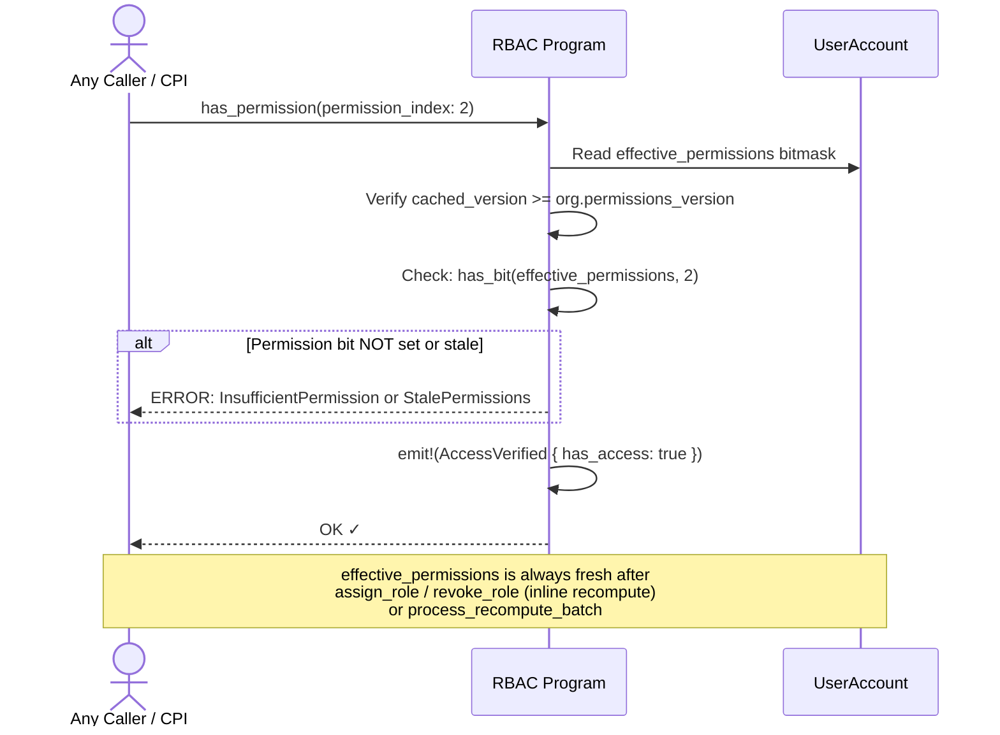
```mermaid
sequenceDiagram
    actor Caller as Any Caller / CPI
    participant P as RBAC Program
    participant UA as UserAccount

    Caller->>P: has_permission(permission_index: 2)

    P->>UA: Read effective_permissions bitmask
    P->>P: Verify cached_version >= org.permissions_version
    P->>P: Check: has_bit(effective_permissions, 2)

    alt Permission bit NOT set or stale
        P-->>Caller: ERROR: InsufficientPermission or StalePermissions
    end

    P->>P: emit!(AccessVerified { has_access: true })
    P-->>Caller: OK ✓

    Note over Caller,UA: effective_permissions is always fresh after<br/>assign_role / revoke_role (inline recompute)<br/>or process_recompute_batch
```

### 5.8 has_role

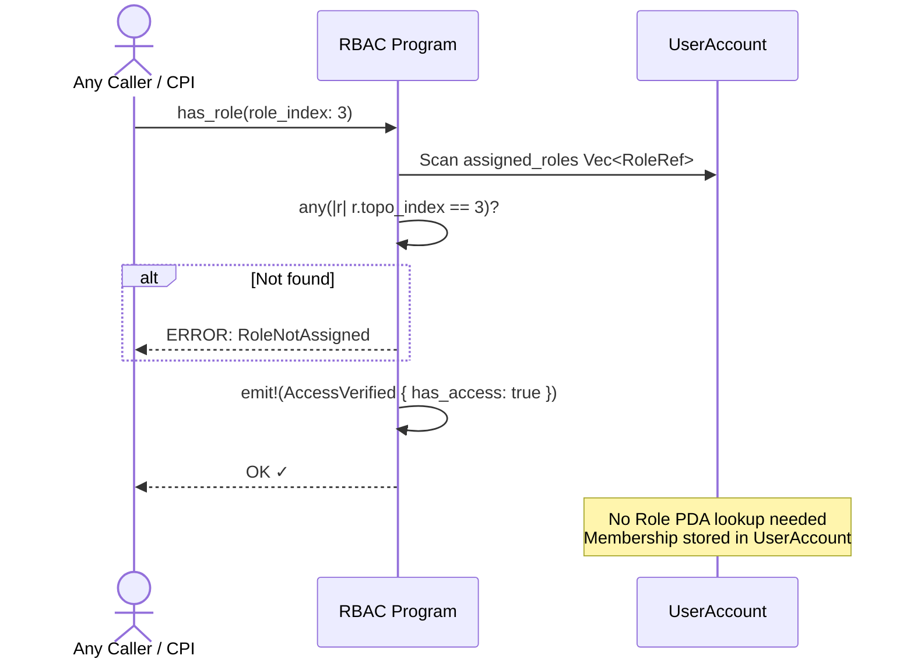
```mermaid
sequenceDiagram
    actor Caller as Any Caller / CPI
    participant P as RBAC Program
    participant UA as UserAccount

    Caller->>P: has_role(role_index: 3)

    P->>UA: Scan assigned_roles Vec<RoleRef>
    P->>P: any(|r| r.topo_index == 3)?

    alt Not found
        P-->>Caller: ERROR: RoleNotAssigned
    end

    P->>P: emit!(AccessVerified { has_access: true })
    P-->>Caller: OK ✓

    Note over UA: No Role PDA lookup needed<br/>Membership stored in UserAccount
```

### 5.9 create_resource / delete_resource

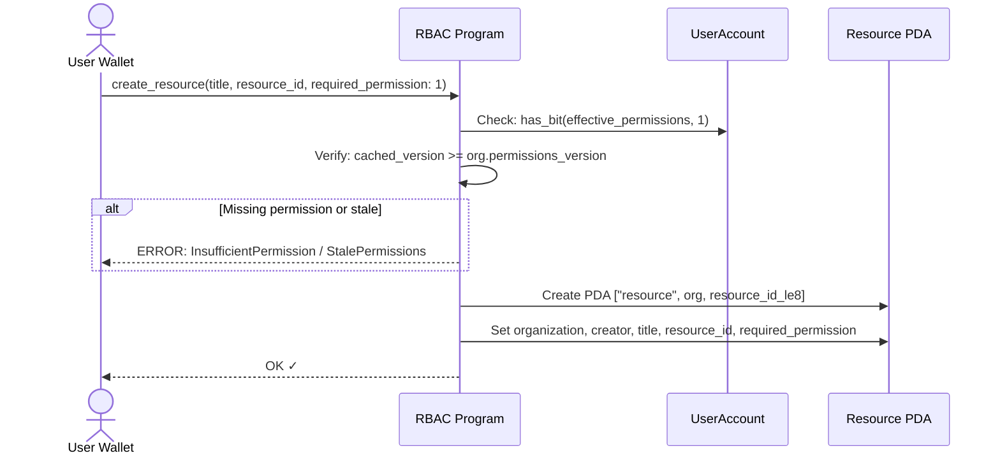
```mermaid
sequenceDiagram
    actor User as User Wallet
    participant P as RBAC Program
    participant UA as UserAccount
    participant Res as Resource PDA

    User->>P: create_resource(title, resource_id, required_permission: 1)

    P->>UA: Check: has_bit(effective_permissions, 1)
    P->>P: Verify: cached_version >= org.permissions_version

    alt Missing permission or stale
        P-->>User: ERROR: InsufficientPermission / StalePermissions
    end

    P->>Res: Create PDA ["resource", org, resource_id_le8]
    P->>Res: Set organization, creator, title, resource_id, required_permission
    P-->>User: OK ✓
```

---

## 6. Permission Check — All Methods

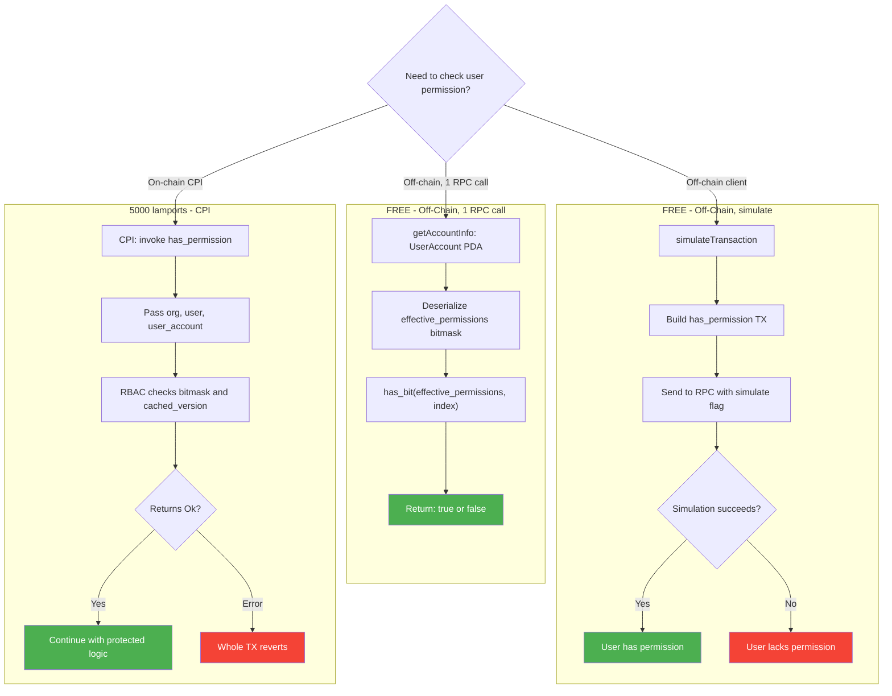
```mermaid
graph TB
    Q{"Need to check user permission?"}

    Q -->|"Off-chain client"| A
    Q -->|"On-chain CPI"| B
    Q -->|"Off-chain, 1 RPC call"| C

    subgraph free1["FREE - Off-Chain, 1 RPC call"]
        C["getAccountInfo: UserAccount PDA"]
        C --> C1["Deserialize effective_permissions bitmask"]
        C1 --> C2["has_bit(effective_permissions, index)"]
        C2 --> C3["Return: true or false"]
    end

    subgraph free2["FREE - Off-Chain, simulate"]
        A["simulateTransaction"]
        A --> A1["Build has_permission TX"]
        A1 --> A2["Send to RPC with simulate flag"]
        A2 --> A3{"Simulation succeeds?"}
        A3 -->|Yes| A4["User has permission"]
        A3 -->|No| A5["User lacks permission"]
    end

    subgraph cpi["5000 lamports - CPI"]
        B["CPI: invoke has_permission"]
        B --> B1["Pass org, user, user_account"]
        B1 --> B2["RBAC checks bitmask and cached_version"]
        B2 --> B3{"Returns Ok?"}
        B3 -->|Yes| B4["Continue with protected logic"]
        B3 -->|Error| B5["Whole TX reverts"]
    end

    style C3 fill:#4CAF50,color:#fff
    style A4 fill:#4CAF50,color:#fff
    style A5 fill:#f44336,color:#fff
    style B4 fill:#4CAF50,color:#fff
    style B5 fill:#f44336,color:#fff
```

---

## 7. Authorization Flow — Who Can Do What

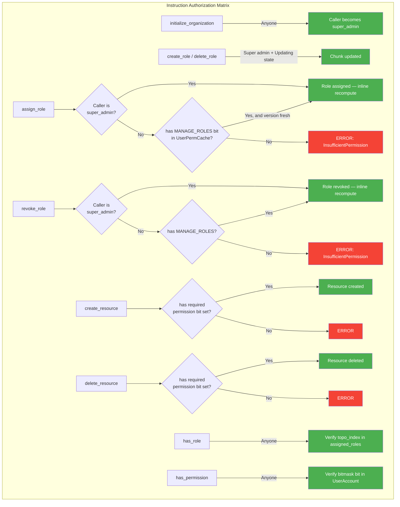
```mermaid
graph TD
    subgraph "Instruction Authorization Matrix"
        Init[initialize_organization] -->|Anyone| InitR[Caller becomes super_admin]

        CrRole[create_role / delete_role] -->|Super admin + Updating state| CrRoleR[Chunk updated]

        AsRole[assign_role] --> AsCheck{Caller is<br/>super_admin?}
        AsCheck -->|Yes| AsRoleR[Role assigned — inline recompute]
        AsCheck -->|No| AsCheck2{has MANAGE_ROLES bit<br/>in UserPermCache?}
        AsCheck2 -->|Yes, and version fresh| AsRoleR
        AsCheck2 -->|No| AsErr[ERROR: InsufficientPermission]

        RvRole[revoke_role] --> RvCheck{Caller is<br/>super_admin?}
        RvCheck -->|Yes| RvRoleR[Role revoked — inline recompute]
        RvCheck -->|No| RvCheck2{has MANAGE_ROLES?}
        RvCheck2 -->|Yes| RvRoleR
        RvCheck2 -->|No| RvErr[ERROR: InsufficientPermission]

        CrRes[create_resource] --> CrResCheck{has required<br/>permission bit set?}
        CrResCheck -->|Yes| CrResR[Resource created]
        CrResCheck -->|No| CrResErr[ERROR]

        DlRes[delete_resource] --> DlResCheck{has required<br/>permission bit set?}
        DlResCheck -->|Yes| DlResR[Resource deleted]
        DlResCheck -->|No| DlResErr[ERROR]

        HasR[has_role] -->|Anyone| HasRR[Verify topo_index in assigned_roles]
        HasP[has_permission] -->|Anyone| HasPR[Verify bitmask bit in UserAccount]
    end

    style AsErr fill:#f44336,color:#fff
    style RvErr fill:#f44336,color:#fff
    style CrResErr fill:#f44336,color:#fff
    style DlResErr fill:#f44336,color:#fff
    style AsRoleR fill:#4CAF50,color:#fff
    style RvRoleR fill:#4CAF50,color:#fff
    style CrResR fill:#4CAF50,color:#fff
    style DlResR fill:#4CAF50,color:#fff
    style InitR fill:#4CAF50,color:#fff
    style CrRoleR fill:#4CAF50,color:#fff
    style HasRR fill:#4CAF50,color:#fff
    style HasPR fill:#4CAF50,color:#fff
```

---

## 8. Multi-Tenant Architecture

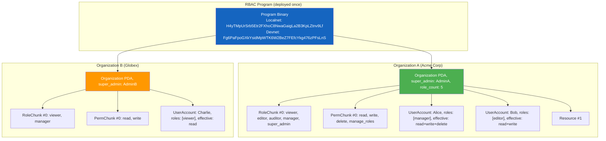
```mermaid
graph TB
    subgraph rbac_prog["RBAC Program (deployed once)"]
        Program["Program Binary<br/>Localnet: H4yTMpUrSrb5Etr2FXhoC8NwaGaigLa2B3KpLZtnv9Lf<br/>Devnet:   Fg6PaFpoGXkYsidMpWTK6W2BeZ7FEfcYkg476zPFsLnS"]
    end

    subgraph org_a["Organization A (Acme Corp)"]
        OrgA["Organization PDA, super_admin: AdminA, role_count: 5"]
        RCA0["RoleChunk #0: viewer, editor, auditor, manager, super_admin"]
        PCA0["PermChunk #0: read, write, delete, manage_roles"]
        UAA1["UserAccount: Alice, roles: [manager], effective: read+write+delete"]
        UAA2["UserAccount: Bob, roles: [editor], effective: read+write"]
        ResA1["Resource #1"]
    end

    subgraph org_b["Organization B (Globex)"]
        OrgB["Organization PDA, super_admin: AdminB"]
        RCB0["RoleChunk #0: viewer, manager"]
        PCB0["PermChunk #0: read, write"]
        UAB1["UserAccount: Charlie, roles: [viewer], effective: read"]
    end

    Program --> OrgA
    Program --> OrgB
    OrgA --> RCA0
    OrgA --> PCA0
    OrgA --> UAA1
    OrgA --> UAA2
    OrgA --> ResA1
    OrgB --> RCB0
    OrgB --> PCB0
    OrgB --> UAB1

    style Program fill:#1565C0,color:#fff
    style OrgA fill:#4CAF50,color:#fff
    style OrgB fill:#FF9800,color:#fff
```

---

## 9. CPI Integration — Other Programs Using RBAC

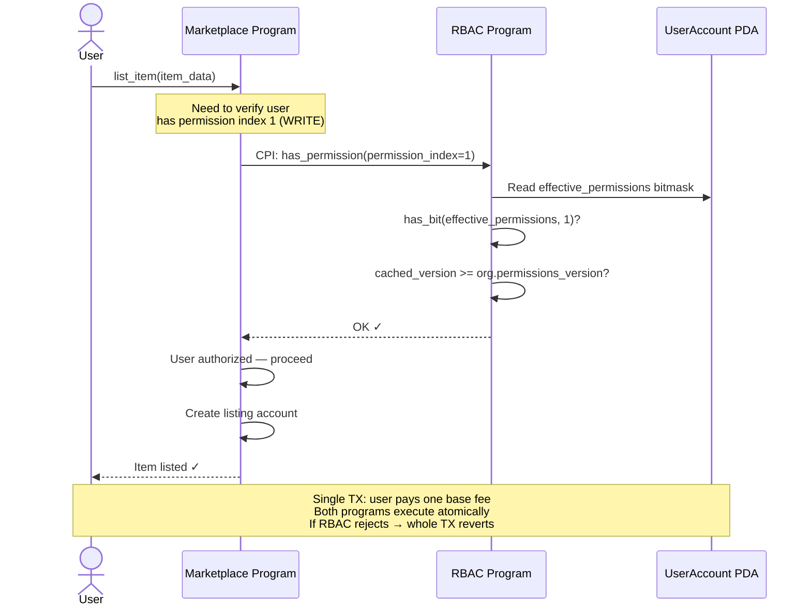
```mermaid
sequenceDiagram
    actor User
    participant MarketPlace as Marketplace Program
    participant RBAC as RBAC Program
    participant UA as UserAccount PDA

    User->>MarketPlace: list_item(item_data)

    Note over MarketPlace: Need to verify user<br/>has permission index 1 (WRITE)

    MarketPlace->>RBAC: CPI: has_permission(permission_index=1)

    RBAC->>UA: Read effective_permissions bitmask
    RBAC->>RBAC: has_bit(effective_permissions, 1)?
    RBAC->>RBAC: cached_version >= org.permissions_version?
    RBAC-->>MarketPlace: OK ✓

    MarketPlace->>MarketPlace: User authorized — proceed
    MarketPlace->>MarketPlace: Create listing account
    MarketPlace-->>User: Item listed ✓

    Note over User,UA: Single TX: user pays one base fee<br/>Both programs execute atomically<br/>If RBAC rejects → whole TX reverts
```

---

## 10. Web2 Integration Architecture

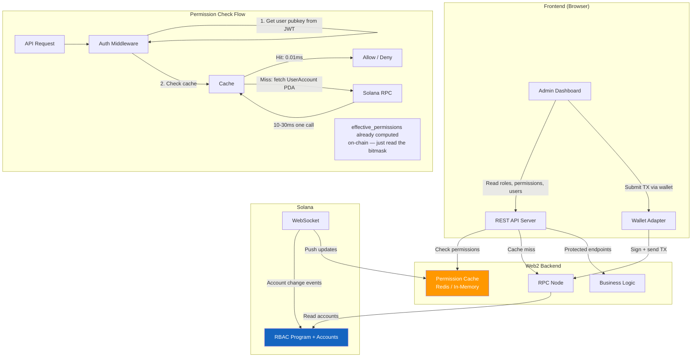
```mermaid
graph TB
    subgraph "Frontend (Browser)"
        UI[Admin Dashboard]
        UI -->|Read roles, permissions, users| API
        UI -->|Submit TX via wallet| Wallet[Wallet Adapter]
    end

    subgraph "Web2 Backend"
        API[REST API Server]
        API -->|Check permissions| Cache[Permission Cache<br/>Redis / In-Memory]
        API -->|Cache miss| RPC
        API -->|Protected endpoints| BizLogic[Business Logic]
    end

    subgraph "Solana"
        RPC[RPC Node]
        WS[WebSocket]
        BC[RBAC Program + Accounts]
        RPC -->|Read accounts| BC
        WS -->|Account change events| BC
    end

    Wallet -->|Sign + send TX| RPC
    WS -->|Push updates| Cache

    subgraph "Permission Check Flow"
        direction LR
        Req[API Request] --> MW[Auth Middleware]
        MW -->|1. Get user pubkey from JWT| MW
        MW -->|2. Check cache| Cache2[Cache]
        Cache2 -->|Hit: 0.01ms| Allow[Allow / Deny]
        Cache2 -->|Miss: fetch UserAccount PDA| RPC2[Solana RPC]
        RPC2 -->|10-30ms one call| Cache2
        Note2[effective_permissions already computed<br/>on-chain — just read the bitmask]
    end

    style Cache fill:#FF9800,color:#fff
    style BC fill:#1565C0,color:#fff
```

---

## 11. Trust & Governance Lifecycle

```mermaid
%%{init: {'flowchart': {'nodeSpacing': 80, 'rankSpacing': 80}}}%%
graph LR
    subgraph phase1["Phase 1: Launch"]
        P1A["Deploy program"]
        P1B["Open source on GitHub"]
        P1C["Verified build on Explorer"]
        P1D["Upgrade authority: YOUR KEY"]
    end

    subgraph phase2["Phase 2: Stabilize"]
        P2A["Security audit completed"]
        P2B["Bug bounty launched"]
        P2C["Create Squads multisig<br/>3-of-5 with org admins"]
        P2D["Transfer upgrade authority<br/>to multisig"]
    end

    subgraph phase3["Phase 3: Decentralize"]
        P3A["Create DAO on Realms"]
        P3B["Transfer authority<br/>to DAO governance"]
        P3C["Community votes<br/>on all upgrades"]
        P3D["Timelock: 7 days"]
    end

    subgraph phase4["Phase 4: Endgame"]
        P4A{"Program stable?"}
        P4A -->|"Yes, no changes needed"| P4B["Make IMMUTABLE<br/>Revoke all authority"]
        P4A -->|"Still evolving"| P4C["Keep DAO governance<br/>Community controls upgrades"]
    end

    P1A --> P1B --> P1C --> P1D
    P1D -->|"3-6 months"| P2A
    P2A --> P2B --> P2C --> P2D
    P2D -->|"6-12 months"| P3A
    P3A --> P3B --> P3C --> P3D
    P3D -->|"12+ months"| P4A

    style P1D fill:#f44336,color:#fff
    style P2D fill:#FF9800,color:#fff
    style P3D fill:#4CAF50,color:#fff
    style P4B fill:#1565C0,color:#fff
    style P4C fill:#4CAF50,color:#fff
```

---

## 12. Complete Transaction Cost Map

```mermaid
%%{init: {'flowchart': {'nodeSpacing': 60, 'rankSpacing': 80}}}%%
graph LR
    subgraph free_ops["FREE Operations (no TX needed)"]
        F1["Check user permission - read UserAccount bitmask"]
        F2["List roles for org - fetch RoleChunk accounts"]
        F3["List permissions for org - fetch PermChunk accounts"]
        F4["WebSocket subscription to account changes"]
        F5["Simulate any instruction"]
    end

    subgraph fee_only["~5000 lamports (base fee only)"]
        T1["begin_update / commit_update / finish_update"]
        T2["add/remove_role_permission"]
        T3["add/remove_child_role"]
        T4["recompute_role"]
        T5["has_role / has_permission on-chain CPI"]
        T6["delete_role / delete_permission (slot cleared, chunk stays)"]
    end

    subgraph fee_realloc["~5000-7000 lamports (fee + possible realloc rent)"]
        T7["create_role - pushes RoleEntry, reallocs chunk"]
        T8["create_permission - pushes PermEntry, reallocs chunk"]
        T9["assign_role - pushes RoleRef, inline recompute"]
        T10["revoke_role - pops RoleRef, inline recompute"]
        T11["assign/revoke_user_permission - inline recompute"]
        T12["create_resource"]
    end

    subgraph fee_refunded["~5000 lamports (fee, rent REFUNDED)"]
        T13["delete_resource - account closed"]
    end

    subgraph one_time["One-Time Costs"]
        O1["Deploy program - ~1.8 SOL deposit REFUNDABLE"]
        O2["Create organization - ~0.001 SOL deposit REFUNDABLE"]
        O3["First role - creates RoleChunk #0"]
        O4["First permission - creates PermChunk #0"]
        O5["Create user account - UserAccount + UserPermCache PDAs"]
    end

    style F1 fill:#4CAF50,color:#fff
    style F2 fill:#4CAF50,color:#fff
    style F3 fill:#4CAF50,color:#fff
    style F4 fill:#4CAF50,color:#fff
    style F5 fill:#4CAF50,color:#fff
    style O1 fill:#1565C0,color:#fff
    style O2 fill:#1565C0,color:#fff
    style O3 fill:#1565C0,color:#fff
    style O4 fill:#1565C0,color:#fff
    style O5 fill:#1565C0,color:#fff
```

---

## 13. Permission Bitmask Encoding

```mermaid
graph LR
    subgraph "Vec<u8> Permission Bitmask (variable length)"
        direction TB
        B0["Byte 0, Bit 0: permission index 0"]
        B1["Byte 0, Bit 1: permission index 1"]
        B2["Byte 0, Bit 2: permission index 2"]
        B3["Byte 0, Bit 3: permission index 3 — MANAGE_ROLES (reserved)"]
        Bn["Byte k, Bit b: permission index k*8 + b"]
    end

    subgraph "Example User effective_permissions"
        Ex1["[0x0B] = 0000_1011<br/>has: index 0, 1, 3"]
        Ex2["[0xFF, 0x01] = supports 9+ permissions<br/>has: indices 0–7 plus index 8"]
    end

    subgraph "Bitmask Helpers (state.rs)"
        H1["has_bit(bitmask, index)"]
        H2["set_bit(bitmask, index)"]
        H3["clear_bit(bitmask, index)"]
        H4["bitmask_union(a, b) → Vec<u8>"]
        H5["bitmask_bytes_for(n_perms) → usize"]
        H6["set_bit_arr / clear_bit_arr — fixed [u8;32] variants"]
        H7["bitmask_union_into(dest, src) — OR src into fixed dest"]
        H8["copy_to_fixed(dest, src) — zero + copy into [u8;32]"]
    end
```

---

## 14. Role Tree — Implemented (Children-First DAG)

> **Key constraint:** `add_child_role` enforces `parent_index > child_index`.
> Children always have **lower** topo_indices than their parents.
> Recompute in **ascending** topo_index order (leaves first, root last).

```mermaid
%%{init: {'flowchart': {'nodeSpacing': 80, 'rankSpacing': 80}}}%%
graph LR
    subgraph chunk0["RoleChunk #0 (chunk_index=0)"]
        subgraph entry0["entries[0]: viewer (topo_index=0)"]
            N0["name: viewer<br/>direct_perms: READ bit<br/>effective_perms: READ<br/>children: none<br/>version: 1"]
        end

        subgraph entry1["entries[1]: editor (topo_index=1)"]
            N1["name: editor<br/>direct_perms: READ, WRITE bits<br/>effective_perms: READ+WRITE<br/>children: none<br/>version: 1"]
        end

        subgraph entry2["entries[2]: auditor (topo_index=2)"]
            N2["name: auditor<br/>direct_perms: READ bit<br/>effective_perms: READ<br/>children: none<br/>version: 1"]
        end

        subgraph entry3["entries[3]: manager (topo_index=3)"]
            N3["name: manager<br/>direct_perms: DELETE bit<br/>effective_perms: READ+WRITE+DELETE<br/>children: 0, 1 (viewer, editor)<br/>version: 2"]
        end

        subgraph entry4["entries[4]: super_admin (topo_index=4)"]
            N4["name: super_admin<br/>direct_perms: MANAGE_ROLES bit<br/>effective_perms: ALL<br/>children: 2, 3 (auditor, manager)<br/>version: 3"]
        end
    end

    N4 -->|child| N3
    N4 -->|child| N2
    N3 -->|child| N1
    N3 -->|child| N0

    subgraph cycle_prev["Cycle Prevention"]
        CP["add_child_role enforces: parent_index > child_index<br/>e.g. viewer(0) CANNOT be parent of editor(1) — 0 is not greater than 1<br/>super_admin(4) is the root — highest topo_index in this org"]
    end

    subgraph recompute["Recompute order — ascending topo_index (leaves first)"]
        R1["1. recompute_role(0): viewer.eff = READ"]
        R2["2. recompute_role(1): editor.eff = READ+WRITE"]
        R3["3. recompute_role(2): auditor.eff = READ"]
        R4["4. recompute_role(3): manager.eff = DELETE ∪ viewer.eff ∪ editor.eff"]
        R5["5. recompute_role(4): super_admin.eff = MANAGE_ROLES ∪ auditor.eff ∪ manager.eff"]
    end

    style N4 fill:#f44336,color:#fff
    style N3 fill:#FF9800,color:#fff
    style N2 fill:#9C27B0,color:#fff
    style N1 fill:#2196F3,color:#fff
    style N0 fill:#4CAF50,color:#fff
```

> **Why this order?** Since `parent_index > child_index` is enforced at write time, a simple ascending sweep guarantees every child is fully computed before any of its parents. No topological sort needed at recompute time.

---

## 15. RoleRef — Per-Role Staleness Tracking

```mermaid
graph LR
    subgraph "UserAccount.assigned_roles: Vec<RoleRef>"
        RA["RoleRef { topo_index: 3, last_seen_version: 5 }"]
        RB["RoleRef { topo_index: 7, last_seen_version: 2 }"]
    end

    subgraph "RoleChunk entries"
        RE3["entries[3].version = 5 ✓ (fresh)"]
        RE7["entries[7].version = 4 ✗ (stale — role changed)"]
    end

    RA -->|matches| RE3
    RB -->|mismatch| RE7

    subgraph "Staleness Detection (off-chain)"
        SD["Compare RoleRef.last_seen_version<br/>vs RoleEntry.version<br/>If mismatch → user needs recompute"]
    end
```

`RoleRef.last_seen_version` is updated on every `assign_role`, `revoke_role`, `assign_user_permission`, `revoke_user_permission`, and `process_recompute_batch`. Off-chain clients can detect staleness without a transaction by comparing these fields.
